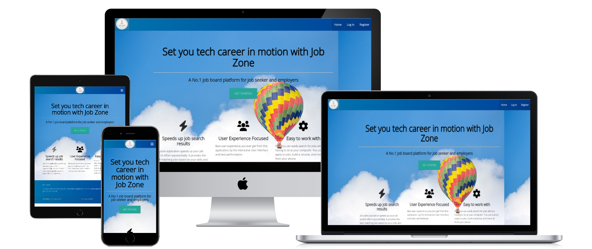
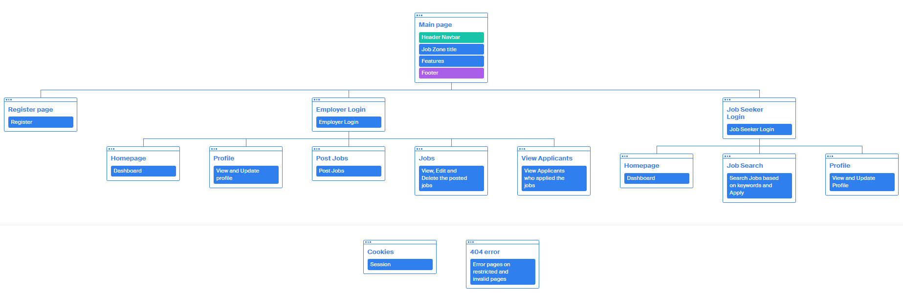
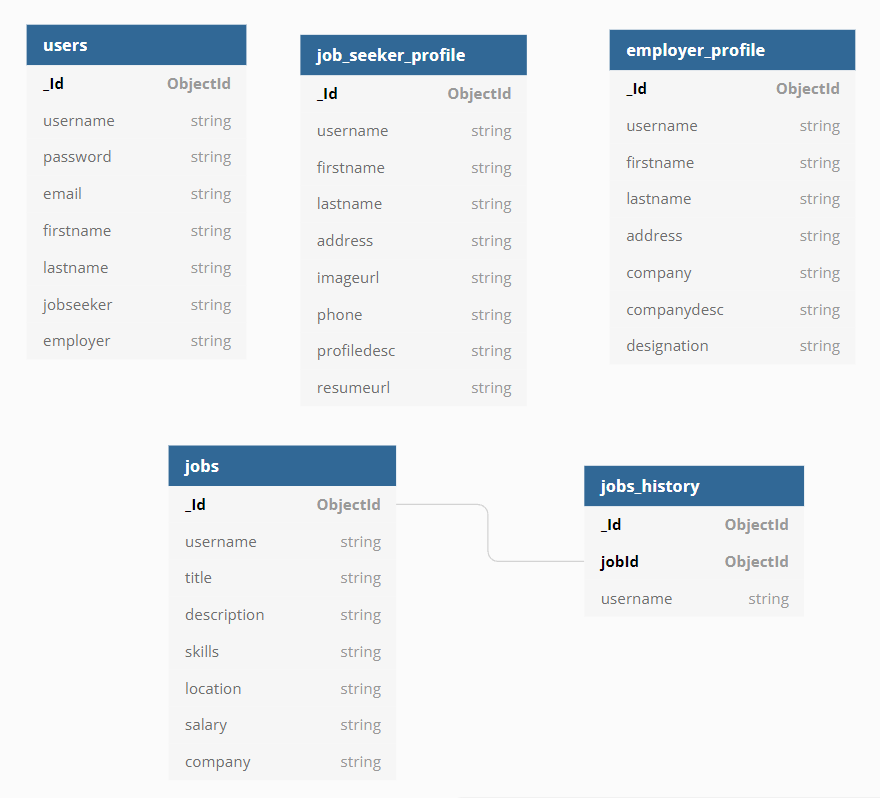
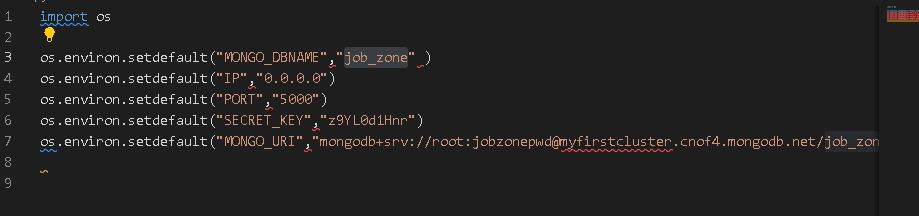

# *JobZone*

JobZone is a website that aims to play a role in bridging the gap between the recruiters and the job seekers. The key targeted user is the recruiter and the job seeker. Recruiters can advertise their job vacancies to job seekers,look for a right candidate who has the right qualification to handle the responsibilities efficiently. On the other hand, job seekers can search/find a job where they can apply their skills and knowledge to grow their professional career.

View the live application: [here](https://job-zone-project.herokuapp.com/)

## *Table of contents*
* [1. What does it do and what does it need to fulfill?](#what-does-it-do-and-what-does-it-need-to-fullfil)
* [2. User Experience](#user-experience)
    * [2.1 Project goals](#project-goals)
    * [2.2 User Stories](#user-stories)
* [3. Wireframes](#wireframes)
    * [3.1 Mobile](#mobile)
    * [3.2 Ipad](#ipad)
    * [3.3 Desktop](#desktop)
* [4. Design](#design)
    * [4.1 Color Scheme](#color-scheme)
    * [4.2 Typegraphy](#typography)
    * [4.3 Imagery](#imagery)
    * [4.5 Interactive Design](#interactive-design)
    * [4.6 Information Architecture](#information-architecture)
* [5. Features](#features)
    * [5.1 Existing Features](#existing-features)
        * [5.1.1 Create](#create)
        * [5.1.2 Read](#read)
        * [5.1.3 Update](#update)
        * [5.1.4 Delete](#delete)
    * [5.2 Features left to implement in future](#features-left)
* [6. Technologies Used](#technology-used)
    * [6.1 Frameworks, Editors & Version Control](#frameworks)
    * [6.2 Tools Used](#tools-used)
* [7. Testing](#testing)
* [8. Deployment](#deployment)
* [9. Requirements](#requirements)

## *What does it do and what does it need to fulfill?*
This milestone project is to demonstrate my knowdlge and skills aquired in the Backend Development module. The main modules include Python Fundamentals, Practical Python and Data Centric Development. Then put all the concepts together to create a fully responsive CRUD web application. This Application will allow a user to create, read, update and delete relevant data when interacting with the Job Zone Application.

### *Functionality of the project*
This application demonstrate the key CRUD requirement functionality, uses a data handling document based database, MongoDB. The user functionality is created using Flask, HTML templates and CSS. A modern front-end framework called Materializecss (similar to Bootsrap) was used in building a beautiful and responsive frontend interface, to promote ease of use and intuition when interacting with app.

The application has a Registration and Login system to show clear seperation between documents created by each Registered user. These functions utilise creating, updating and reading to the database along with password hashing to protect each individuals credentials.The user has to be registered if they want to use the site.

## *User Experience*

### Project goals
The goal is to help both organizations and job seekers to connect and grow together. To help
 employers speed up their hiring process. It would be easier for hiring managers to check job applications online than manually scan printed resumes. The site give employers access to a list of candidates with the required skills, achievements, and experience to select from. This helps them save time, effort and is cost effective for both the employer and jobseekers.

### *User Stories*
_First Time Visitor:_
* As a first time visitor, I want the main purpose of the site to be clear so that I immediately know what the site is intended for upon entering.
* As a first time vistor, I want to visit a job portal website so that I can search for job opportunities or for job seekers.
*  As a first time vistor, I want the site to be responsive so that I can easily view the webpages from my mobile, tablet or desktop device.
* As a first time vistor, I want to see the menu bar so that I can easily navigate the website.
* As a first time vistor, I want to be met with visually appealing, intuitive and easy to read layouts.
*  As a first time vistor, I want to see how I can get started or register to the website so that I can view any job openings, create and track my own activities.
* As a first time vistor I want to see how I can get started or register to the website so that I can view job seekers 's profile and contact them for interview if I need to.
* As a first time vistor I want to see the social media links so that I can connect with JobZone.

_Registered (Job Seeker) User:_

All the user stories mentioned in the first time vistor to the site, also applies to the registered users (Job Seeker). Below I have listed additional user stories for a Job Seeker.

* As a Job Seeker, I want to find out how I can login to my account so that I can view my profile anytime.
* As a Job Seeker, I want to be able to create and update my profile so that I keep it up to date.
* As a Job Seeker, I want to be able to upload my profile picture and resume so that the employer can know more about myself.
* As a Job Seeker, I want to be able to  search jobs so that I can see all the job openings.
* As a Job Seeker, I want to be able to filter job posts using the key words so that I can know which job do I qualify for and apply for.
* As a Job Seeker, I want to be able to see a flash message, when I have created or updated my profile and also a notification when I have applied for a job successfully.
* As a Job Seeker I want to see the Job Dashbord so that I can view, edit my profile or have the search functionality.
* As a  Job Seeker, I want to be able to log out of my account.

_Registered (Employer) User:_

All the user stories mentioned in the first time vistor to the site, also applies to the registered users (Employer). Below I have listed additional user stories for the Employer.

* As an Employer, I want to find out how I can login to my account so that I can view the Comapny profile anytime.
* As an Employer, I want to be able to create a Company profile and edit at anytime, so that I keep it up to date.
* As an Employer, I want to be able to post jobs so that I can attract new talent.
* As an Employer, I want to be able to manage jobs, so that I can update, activate or deactivate jobs.
* As an Employer, I want see all applicants who have applied for a particular job posting so that I can shortlist them.
* As an Employer, I want to be able to download candidates resume so that I can have them ready for interview.
* As an Emplyer, I want to be able to log out of my account.

_Developer:_
* As a Developer, I want to expand my knowledge with Python and Flask by creating an extensive management database application.
* As a Developer, I want to create a fully-responsive mobile-friendly multi-language faceted project to showcase what I have learned whilst on this course.
* As a Developer, I want a project which can evolve as I grow as a developer.

## _Wireframes_
All the wirframes are designed to display on different screen sizes, laptop/computer, ipad/tablet and mobile view.

##### MOBILE

* [home](wireframes/mobile/home.PNG)
* [register](wireframes/mobile/register.PNG)
* [login](wireframes/mobile/login.PNG)
* [view profile](wireframes/mobile/view-profile.PNG)
* [update profile](wireframes/mobile/update-profile.PNG)
* [post jobs](wireframes/mobile/post-jobs.PNG)
* [manage jobs](wireframes/mobile/manage-jobs.PNG)
* [view applicants](wireframes/mobile/view-applicants.PNG)
* [job search](wireframes/mobile/job-search.PNG)

##### IPAD

* [home](wireframes/ipad/home.PNG)
* [register](wireframes/ipad/register.PNG)
* [login](wireframes/ipad/login.PNG)
* [view profile](wireframes/ipad/view-profile.PNG)
* [update profile](wireframes/ipad/update-profile.PNG)
* [post jobs](wireframes/ipad/post-jobs.PNG)
* [manage jobs](wireframes/ipad/manage-jobs.PNG)
* [view applicants](wireframes/ipad/view-applicants.PNG)
* [job search](wireframes/ipad/job-search.PNG)

##### DESKTOP

* [home](wireframes/desktop/home.PNG)
* [register](wireframes/desktop/register.PNG)
* [login](wireframes/desktop/login.PNG)
* [view profile](wireframes/desktop/view-profile.PNG)
* [update profile](wireframes/desktop/update-profile.PNG)
* [post jobs](wireframes/desktop/post-jobs.PNG)
* [manage jobs](wireframes/desktop/manage-jobs.PNG)
* [view applicants](wireframes/desktop/view-applicants.PNG)
* [job search](wireframes/desktop/job-search.PNG)

### *DESIGN*
* I decided to keep the design of the application minimalistic and clean.
* Each page contains relevant contenet to communicate to the user rather than to overwhelm them with unneccessary information.
* Links and buttons have a hover effect.
* I decided to use cards and tables to keep information clear and easy to read
* Used a background color to add a pop on firing flash messages

#### *Color Scheme*
* The colors used throughout the website are:

RGB (0,64,153): This dark blue color is used on the navigation bar and the icons used on profile pages has a blue with a gradient  dark blue background on menu items.

RGB (9,148,218): This greenish color is used as a background color for the buttons, it has a very light green color on hoovering the button. 

#F5F5F5: This whitesmoke color is used as a background  color of the body. 
 
A #b3e5fc is applied on flash messages.
  
A grey color is used on the table for search jobs to make the the jo search stand out.

#### *Typography* 
 The main font used is <a href="https://fonts.google.com/specimen/Open+Sans?category=Sans+Serif">Open Sans</a>. I decided to use this font in the entire application due to its elegant, sophisticated, yet modern. It is beautifully legible and offers an excellent reading experience, which I thought it would be a perfect font for a job portal app.

<a href="https://fonts.google.com/specimen/Open+Sans?category=Sans+Serif">Sans serif</a> is used as a fallback font, in cases where Open Sans for some reasons have difficulty loading or fails to load altogether, This is where it takes over and load in the browser to back up the failed font.
 
### *Imagery*
* The banner image on landing page is from <a href="https://www.pexels.com/photo/hot-air-balloon-photo-597054/">Pixels</a>
* Icons are from <a href="https://fontawesome.com/v4.7/icons/">Font Awesome</a>

#### *Interactive design*
* The website has to be easy to navigate.
* The user can easily find the information he/she wants to find.

#### *Information architecture*
* The project has five collections in the database. The database structure in MongoDB is as follows:

## *FEATURES*

#### *Existing Features*
* The project boasts several key features:

**Create:** Several instances of create functionality as per CRUD through 
        - The Registration form, creating a new user in the database.
        - The Job seeker profile, creating page that saves the data in the database.
        - The Manage Jobs section for employer, user can view edit or update pre-existing job.

**Read:** Is implemented throughout the site from job search to view applicants.
        - The job seeker search functionality directly read the data from the database and filter it.
        - The Job seeker view, Profile section that loads data from database.
        - The Employer view, Profile section that loads data from database.
        - The Employer view, applicant page that read data from the database.

**Update:** Present for a logged in user ~
        - The job seeker profile, updating page that update the data in the database.
        - The Employer, update profile page that update the existing data in database.
        - The Manage Jobs section employer can update current posted jobs.

**Delete:** Present for a logged in user ~ 
        - An employer can delete a Job/jobs which vacancies have been filled. 

* Authentication and authorization functionality to make the application secure. 
* Perfect error handing for unknown and restricted routes.
* Responsive Design that enhance the user experience on big screens(desktop) and small screens(tablet or mobile phones). 
* Custom themed and styled browser scrollbar.
* Responsive menu that is easy to adjust on screen with any resolution. 
* Dashboard for the job seeker and that display different sections of his profile and some statistics.                           
    
#### *Features left to implement in feature*
* Job application tracking feature that helps job seeker and employer both to see the current status of job application.
* Advance search functionality that gives more accurate result to the job seeker.
* Dashboard for employer that show some graphical representation.
* Reporting functionality for employer.
* Account settings for job seeker to manage active/ inactive his availability and block the companies.
* Admin login that manage the roles and create different fields or lists so that it can be used throughout the application by job seeker and employer.

## *Technology Used*

#### *Frameworks, Editors & Version Control*:
* <a href="https://en.wikipedia.org/wiki/HTML5">HTML5</a> ~ Used for structuring the website.
* <a href="https://en.wikipedia.org/wiki/CSS">CSS3</a> ~ Used to write custom style for the HTML code.
* <a href="https://en.wikipedia.org/wiki/JavaScript">JavaScript</a> ~ Used for interactivity on the website.
* <a href="https://en.wikipedia.org/wiki/Python_(programming_language)">Python</a> ~ Used for backed logic.
* <a href="https://jquery.com/">JQuery</a> ~ Used as a JavaScript library
* <a href="https://materializecss.com/">Materializecss</a> ~ Used .....
* <a href="https://www.gitpod.io/">Gitpod</a> ~ Is the code editor used to develop, commit & push this project to Github.
* <a href="https://github.com/">GitHub</a> ~ Used to host the repository of all previous versions of the build and linked to Heroku to push the latest changes to the deployed build version held there.
* <a href="https://www.heroku.com/">Heroku</a> ~ A cloud platform as a service enabling deployment for this CRUD application.
* <a href="https://fonts.google.com/">Google Fonts</a> ~ Used as a font resource.
* <a href="https://flask.palletsprojects.com/en/1.1.x/">Flask</a> ~ Used as a microframework for Python
* <a href="https://jinja.palletsprojects.com/en/2.11.x/">Jinja</a> ~ Used .....
* <a href="https://werkzeug.palletsprojects.com/en/1.0.x/">Werkzeug</a> ~ Used .....

#### *Tools used*
* <a href="https://validator.w3.org/">W3C Markup Validation Service </a> ~ Used to check validity of HTML code.
* <a href="https://jigsaw.w3.org/css-validator/">W3C CSS Validator</a> ~ Used to check validity of CSS code.
* <a href="https://jshint.com/">JShint</a> ~ Used to check the quality of the Javascript code.
* <a href="https://developer.chrome.com/docs/devtools/open/">Chrome DevTools</a> ~ Used for debugging jquery code, checking responsiveness of application and validating api calls.
* <a href="http://pep8online.com/">PEP8</a> ~ Used to check Python code for PEP8 requirements. requirements.
* <a href="https://www.mongodb.com/cloud/atlas">MongoDB Atlas</a> ~ Non-relational database hosting service used.
* <a href="https://www.figma.com/">Figma</a> ~ Used for creating wireframes.
* <a href="https://realfavicongenerator.net/">Favicon Generator</a> ~ Used to create favicon from custom Logo I created for the project.
* <a href="https://fontawesome.com/v5.15/icons?d=gallery&p=2">Font Awesome Icons</a> ~ For social icons used in Footer.
* <a href="https://websitemockupgenerator.com/">Website Mockup Generator</a> ~ Used to test responsiveness all kind of devices.

### *Testing*
The testing process can be found here <a href="Testing.md">here</a>
 

### *Deployment*

#### *Requirements*
* Python3
* Github account
* MongoDB account
* Heroku account

#### *Clone the project*
To make a local clone, follow the following steps.
1. Log in to GitHub and go to the repository.
2. Click on the green button with the text “Code”.
3. Click on “Open with GitHub Desktop” and follow the prompts in the GitHub Desktop Application or follow the instructions from <a href="https://docs.github.com/en/repositories/creating-and-managing-repositories/cloning-a-repository">GitHub Docs</a> to see how to clone the repository in other ways.

#### *Working with the local copy*
1. Install all the requirements: Go to the workspace of your local copy. In the terminal window of your IDE type: **pip3 install -r requirements.txt.**
2. Create a database in MongoDB
    * Signup or login to your MongoDB account.
    * Create a cluster and a database.
    * Create five collections in the db: employer_profile, job_seeker_profile, jobs, jobs_history, users.
    * Add string values for the collections. See my **Information architecture** how the database is set up for this project.
3. Create the environment variables 
    * Create a .gitignore file in the root directory of the project.
    * Add the env.py file in the .gitignore.
    * Create the file env.py. This will contain all the envornment variables. 
    
4. Run the app: Open your terminal window in your IDE. Type python3 app.py and run the app.

#### *Heroku Deployment*
1. Set up local workspace for Heroku 
    * In terminal window of your IDE type: **pip3 freeze -- local > requirements.txt.** (The file is needed for Heroku to know which filed to install.)
    * In termial window of your IDE type: python app.py > Procfile (The file is needed for Heroku to know which file is needed as entry point.)

2. Set up Heroku: create a Heroku account and create a new app and select your region.
3. Deployment method 'Github' 
    * Click on the **Connect to GitHub** section in the deploy tab in Heroku. 
        - Search your repository to connect with it.
        - When your repository appears click on **connect** to connect your repository with the Heroku.    
    * Go to the settings app in Heroku and go to **Config Vars.** Click on **Reveal Config Vars.**
        - Enter the variables contained in your env.py file. it is about: **IP, PORT, SECRET_KEY, MONGO_URI, MONGO_DBNAME** 
4. Push the requirements.txt and Procfile to repository~ *git add*, *commit message* and *push* to the to repository.
5. Automatic deployment: Go to the deploy tab in Heroku and scroll down to **Aotmatic deployments.** Click on **Enable Automatic Deploys.** By **Manual deploy** click on **Deploy Branch.**

Heroku will receive the code from Github and host the app using the required packages. Click on **Open app** in the right corner of your Heroku account. The app wil open and the live link is available from the address bar.

### *Credits*
* The text in the website is my own.
* Initial structure of the application was taken from Task Manager mini project.
*  Hashing passwords using Werkzeug credit to Pipy.org and and werkzeug parallel project.
* Maintain the site Responsiveness by materializecss.
* The cdnjs site to get all the cdn regrding fontawsome and jquery.
* Registring the custom 404 error handler in app by stackoverflow
* Custom tables to perform add/edit/update operations from<a href="https://blog.miguelgrinberg.com/">Miguel Grinberg</a> blog.
* Professional logo from looka.com

* Created cluster and database from <a href="https://www.mongodb.com/cloud">MongoDB Cloud</a>

#### *Images*
* Landing page banner image source <a href="https://www.pexels.com/photo/hot-air-balloon-photo-597054/">Pixels</a> 

#### *Special Thanks & Acknowledgements*
A thank you to my friends and family for testing the Application for me. Also a thank you to my mentor for the help and support, those in Slack and Tutor Support especially Alan for his tremendous support.

