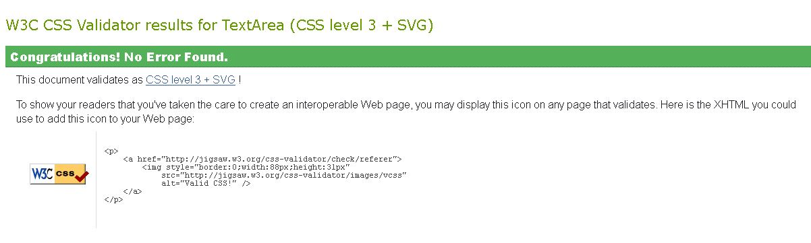

<h1 align="center">Testing</h1>

---

## Index 

- <a href="#validators">1. Code validators</a>
- <a href="#responsiveness">2. Responsiveness</a>
- <a href="#browser-compatibility">3. Browser compability</a>
- <a href="#user-stories">4. Testing user stories </a>
- <a href="#bugs">5. Bugs</a>

---

## 1. Code validators
 - **[HTML Validator](https://validator.w3.org/):** No errors to show.
    - With testing the HTML code, I had some syntax issues on all pages I build with jinja templating.
    - I tested the HTML code by running my server locally and used view page source. This code I passed through the validator.
    - I checked the html code in html-checker site and found one issue as "Start tag head seen but an element of the same type was already open". I fixed this by moving all the css links from above head to inside head section.

    

- **[CSS Validator](https://jigsaw.w3.org/css-validator/):** No errors found.

- **[JS Hint](https://jshint.com/):** No errors found, two warnings, one undefined variable 
    - No error found.
    - 1 undefined variable: $

- **[Python validator | PEP8](http://pep8online.com/):** 
    While checking with the PEP8 Online validator, I found the issue related to indentation and missing whitespaces around operator. I fixed these issues by correcting indentation and adding whitespaces.

---

## 2. Responsiveness 
- Responsiveness of the application is tested with [Chrome DevTools](https://developers.google.com/web/tools/chrome-devtools) and [Responsive Design Checker](https://www.responsivedesignchecker.com/).
- The Job zone application is tested on the following devices: 
    - Desktop: 1024px, 1366px, 1440px, 1600px and 1680px. 
    - Mobile & Tablet: Galaxy S5, iPhone 5/SE, iPhone 6/7/8, iPhone 6/7/8 plus, iPhone x, iPad and  iPad Pro

---

## 3. Browser compatibility

--- 

## 4. Testing user stories 

USER STORIES TESTING

FIRST TIME VISITOR:

1. As a first time visitor, I want the main purpose of the site to be clear so that I immediately know what the site is intended for upon entering.
When users enter the website the headings is presented  in big and bold texts on the homepage
 to show to users what the website is about and who it's target audience is

2. As a first time vistor, I want to visit a job portal website so that I can search for job opportunities or for job seekers.
the first visitor, can use the website address in order to visit the site and search for opportunities or for job seekers.
 
3. As a first time vistor, I want the site to be responsive so that I can easily view the webpages from my mobile, tablet or desktop device.
The first time visitor can visite the website on a computer, laptop, tablet and phone.

4. As a first time vistor, I want to see the menu bar so that I can easily navigate the website.
The first time visitor can navigate through the website using the navigation menu which is located at the top of the website. The navigation menu will be displayed on all webpages. This will redirect users to the appropriate page when clicked.
 On smaller devices, the menu will collapse into a hamburger menu to make efficient use of screen space.

5. As a first time vistor, I want to be met with visually appealing, intuitive and easy to read layouts.
The first time visitor, is met by a simple nice looking site and easy layouts to read or look for information.

6. As a first time vistor, I want to see how I can get started or register to the website so that I can view any job openings, create and track my own activities.

 A first time visitor can easily regitser to site, straight by using the regiter link on the navagation bar or simply clicking the
 get started button.

 - here the user need to check job seekers radio button during the registration process. when the user is  successfully registered, the job seeker navigation bar is displayed at the top.

 The user can click the search job link to view the job openings.
 The navigation menu will contain the following items:
 - Home
 - Profile
 - Search jobs
 - Log out
 
 7. As a first time vistor I want to see how I can get started or register to the website so that I can view job seekers 's profile and contact them for interview if I need to.
 A first time visitor can easily regitser to site, straight by using the regiter link on the navagation bar or simply clicking the get started button.
 - here the user need to check employer radio button during the registration process. when the user is  successfully registered, the employer navigation bar is displayed at the top.

 The user can click the view applicants in order to see the job seekers profile and contact them for interview.

 The navigation menu will contain the following items:
 - Home
 - Profile
 - Post jobs
 - Manage jobs
 - View job applicants
 - Logout
 
 8. As a first time vistor I want to see the social media links so that I can connect with JobZone.
 A fisrt time visitor can scroll down to the footer of the page to find social media icons and connect with Job Zone iregardless what page they are on. 
 
 Registered (Job Seeker) User:
 
 1. As a Job Seeker, I want to find out how I can login to my account so that I can view my profile anytime.
 On the navigation bar, right next to Register tab, Login link is presented for registered users, which takes them to Login page.
 
 2. As a Job Seeker, I want to be able to create and update my profile so that I keep it up to date.
 The user fill in their username and passorword, then clicks the login button which takes the user to their profile page. The user can then 
 update their profile, in case the user does not have a profile created the time they click the login in button, they will get a flash message
 incorrect password/or username.
 
 3. As a Job Seeker, I want to be able to upload my profile picture and resume so that the employer can know more about myself.
 The user can upload documents by clicking on the profile tab from the job seekers navigation menu. To upload their profile picture and resume these documents must be stored online. Then the user need to put a url of the profile picture and resume,
 If they have entered all the information required then they can click the upadte button. Once this is done, the job seeker's documents will be 
 available to the employer whom the have only appied their job.
 
 4. As a Job Seeker, I want to be able to search jobs so that I can see all the job openings.
 The joob seeker can easily search for job by clicking the job search jobs which opens the search jobs page. The jod seeker can filter or click
 the search button in order to see the job openings.
 
 5. As a Job Seeker, I want to be able to filter job posts using the key words so that I can know which job do I qualify for and apply for.
 While the job seeker is still on the job search page, they can filter jobs by any keywords they want.
 
 6. As a Job Seeker, I want to be able to see a flash message, when I have created or updated my profile and also a notification when I have applied for a job successfully.
 The job seeker can see all the applicable flash messages not only if they have created, updated their profile. when a job seeker find a post he/she
 is interested in they can easily apply by clicking the apply button on the job post and get a flash message "job applied successfully".
 
 7. As a Job Seeker I want to see the Job Dashbord so that I can view, edit my profile or have the search functionality.
 when the job seeker clicks on the home tab on the navvigation bar, it takes them to the job seekers dashboard. Here they canview,
 update profile, search and appy for jobs.
 
 8. As a Job Seeker, I want to be able to log out of my account.
 on the jobseeker's navigation menu, they can simply logout of the application.
 
 Registered (Employer) User:
 
 1. As an Employer, I want to find out how I can login to my account so that I can view the Comapny profile anytime.
  On the navigation bar, right next to Register tab, Login link is presented for registered users, which takes them to Login page.
 
 2. As an Employer, I want to be able to create a Company profile and edit at anytime, so that I keep it up to date.
 The user fill in their username and passorword, then clicks the login button which takes the user to their profile page.The user can then 
 edit their profile. If the employer is only interested in creating a Company profile, a basic profile with their name, surname and email address is created during the registration and tey can always come back to edit the profile.
 In a case the user does not have a profile created the time they click the login in button, they will get a flash message
 incorrect password/or username.
 
 3. As an Employer, I want to be able to post jobs so that I can attract new talent.
 Employer can post job by clicking the post job link which will open post a job page. The employer can fill in the form provided and then click the post button and the job will be successfully created. The will be a flash message stating the job is succefully posted.
 
 4, As an Employer, I want to be able to manage jobs, so that I can update, activate or deactivate jobs.
 The employer can update, activate or deactivate jobs by clicking on the manage jobs button tab which will open the manage job page.
 Then the employer can decide to update, activate or deactivate a job. 
 
 5. As an Employer, I want see all applicants who have applied for a particular job posting so that I can shortlist them.
 The employer can view all the applicants who have applied for a job by clicking view job applicants tab which will open the manage job page.
 The employer can decide whether he/she want to download applicants resume or contact them.
 
 6. As an Employer, I want to be able to download candidates resume so that I can have them ready for interview.
 While the employer is still on the view job applicants page, they can download the candidtae tesume and have it hand for interview.
 
 7. As an Emplyer, I want to be able to log out of my account.
  on the employer's navigation menu, they can simply logout of the application.

 
 --- 

## 5. Bugs | Solved
1. A bug was found by entering employer related url while logged in as Job Seeker, It was showung the page but no data. I need to restrict the users based on roles.
    - I solved this problem by adding checks in each view functions to check role.
    - I added 404 error page and showed it in case of invalid url.
2. A bug was found while checking reponsive functionality on mobile, the user interface of profile section got unstructured
    - I solved it by removing the unused left and right margin. 
3. A bug was found once user tried to enter something in salary text box and user were able to enter alphabets as well as numbers.
    - I solved this by changing the input type to numeric instead of text.
    - I also added currency dropdown that provide users a facility to choose any currency

---

[Go to README.md file](README.md).